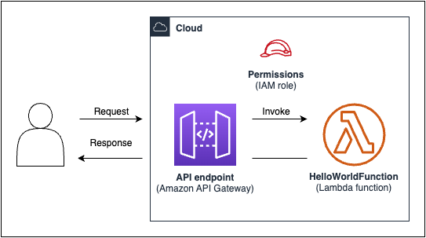
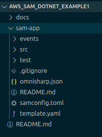
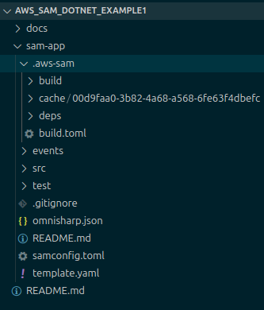
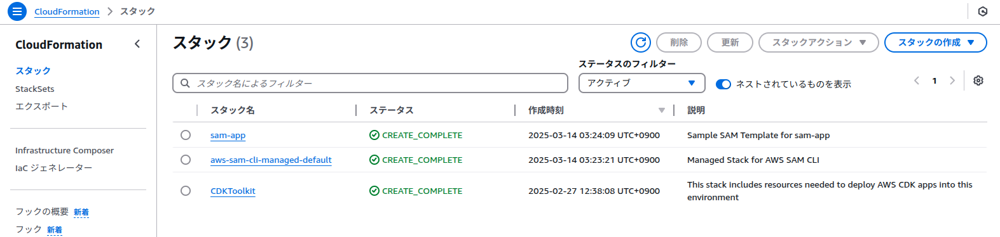
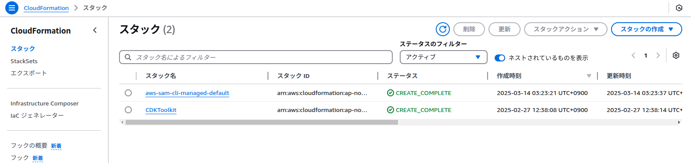

# aws_sam_dotnet_example1

## 概要
* AWS SAM の Hello World チュートリアルを実施してみる。
* Lambda のランタイムに .NET 8 を使用する。

チュートリアル: を使用して Hello World アプリケーションをデプロイする AWS SAM  
https://docs.aws.amazon.com/ja_jp/serverless-application-model/latest/developerguide/serverless-getting-started-hello-world.html  

  
> 出典: [チュートリアル: を使用して Hello World アプリケーションをデプロイする AWS SAM](https://docs.aws.amazon.com/ja_jp/serverless-application-model/latest/developerguide/serverless-getting-started-hello-world.html)

## 目次
* [事前準備](#事前準備)
* [環境情報](#環境情報)
* [注意事項](#注意事項)
* [ステップ 1: サンプルの Hello World アプリケーションを初期化する](#ステップ-1-サンプルの-hello-world-アプリケーションを初期化する)
* [ステップ 2: アプリケーションを構築する](#ステップ-2-アプリケーションを構築する)
* [ステップ 3: アプリケーションを にデプロイする AWS クラウド](#ステップ-3-アプリケーションを-にデプロイする-aws-クラウド)
* [ステップ 4: アプリケーションを実行する](#ステップ-4-アプリケーションを実行する)
* [ステップ 5: (※未実施)で 関数を操作する AWS クラウド](#ステップ-5-で-関数を操作する-aws-クラウド)
* [ステップ 6: (※未実施)アプリケーションを変更して に同期する AWS クラウド](#ステップ-6-アプリケーションを変更して-に同期する-aws-クラウド)
* [ステップ 7: (※未実施)(オプション) アプリケーションをローカルでテストする](#ステップ-7-オプション-アプリケーションをローカルでテストする)
* [ステップ 8: からアプリケーションを削除する AWS クラウド](#ステップ-8-からアプリケーションを削除する-aws-クラウド)

## 事前準備
* IAM ユーザーアカウントを作成する
* 作成した IAM ユーザーアカウントのアクセスキーを発行する
* AWS CLI をインストールする
* AWS SAM CLI をインストールする  
* Docker をインストールする(※)  
* .NET 8 SDK をインストールする(※)

※Docker のインストールは必須ではありませんが、Docker が無い場合、
  .NET 8 SDK などランタイムに指定した言語がローカルにインストールされていないと `sam build` でエラーになります。

AWS SAM 前提条件  
https://docs.aws.amazon.com/ja_jp/serverless-application-model/latest/developerguide/prerequisites.html  

AWS SAM CLI のインストール  
https://docs.aws.amazon.com/ja_jp/serverless-application-model/latest/developerguide/install-sam-cli.html

## 環境情報
```
$ cat /etc/os-release | grep PRETTY_NAME
PRETTY_NAME="Ubuntu 24.04.2 LTS"

$ aws --version
aws-cli/2.18.6 Python/3.12.6 Linux/6.11.0-19-generic exe/x86_64.ubuntu.24

$ sam --version
SAM CLI, version 1.135.0

$ docker --version
Docker version 28.0.1, build 068a01e

$ dotnet --version
8.0.400
```

## 注意事項
* `sam init` の hello-world テンプレートで作成された .gitignore に `.sam-app/` の指定が無い。  
  `.sam-app` フォルダはアップすべきではないので、Git を利用する場合は除外対象に追加すること。

## ステップ 1: サンプルの Hello World アプリケーションを初期化する

※チュートリアルと異なりランタイムに .NET 8 を指定しています。また、対話形式ではなくコマンドの引数でパラメータを指定しています。

1. 初期化コマンドを実行する  
    ※Windows の場合は Git-Bash を用いるか `\` と改行を削除して 1 行にして実行してください。
    ```
    sam init \
        --name sam-app \
        --architecture x86_64 \
        --runtime dotnet8 \
        --dependency-manager cli-package \
        --app-template hello-world \
        --no-interactive \
        --no-tracing \
        --no-application-insights \
        --no-structured-logging
    ```
1. `sam-app` フォルダが作成される  
    

## ステップ 2: アプリケーションを構築する

※以下の手順は Docker の使用を前提にしています。Docker を使用しない場合は、ローカルに .NET 8 SDK をインストールし、`sam build` の `--use-container --mount-with WRITE` の指定を削除して実行してください。 

1. カレントディレクトリを sam-app に移動する `cd ./sam-app` 
1. `sam build --use-container --mount-with WRITE` を実行する
    ```
    $ sam build --use-container --mount-with WRITE
    Starting Build use cache                                                                                                                                                                                                                    
    Starting Build inside a container                                                                                                                                                                                                           
    Cache is invalid, running build and copying resources for following functions (HelloWorldFunction)                                                                                                                                          
    Building codeuri: /home/tobotobo/Desktop/projects/aws_sam_dotnet_example1/sam-app/src/HelloWorld runtime: dotnet8 architecture: x86_64 functions: HelloWorldFunction                                                                        

    Fetching public.ecr.aws/sam/build-dotnet8:latest-x86_64 Docker container image...........................................................................................................................................................................................................................................................................................................................................................................................................................................
    Mounting /home/tobotobo/Desktop/projects/aws_sam_dotnet_example1/sam-app/src/HelloWorld as /tmp/samcli/source:rw,delegated, inside runtime container                                                                                        
    Workflow DotnetCliPackageBuilder does not support value "False" for building in source. Using default value "True".
    Running DotnetCliPackageBuilder:GlobalToolInstall
    An issue was encountered verifying workloads. For more information, run "dotnet workload update".
    You can invoke the tool using the following command: dotnet-lambda

    Tool 'amazon.lambda.tools' (version '5.12.4') was successfully installed.
    Running DotnetCliPackageBuilder:RunPackageAction
    Amazon Lambda Tools for .NET Core applications (5.12.4)
    Project Home: https://github.com/aws/aws-extensions-for-dotnet-cli, https://github.com/aws/aws-lambda-dotnet

    Executing publish command
    ... invoking 'dotnet publish', working folder '/tmp/samcli/source/bin/Release/net8.0/publish'
    ... dotnet publish "/tmp/samcli/source" --output "/tmp/samcli/source/bin/Release/net8.0/publish" --configuration "Release" --framework "net8.0" --runtime linux-x64 /p:GenerateRuntimeConfigurationFiles=true --self-contained False 
    ... publish:   Determining projects to restore...
    ... publish:   Restored /tmp/samcli/source/HelloWorld.csproj (in 3.68 sec).
    ... publish:   HelloWorld -> /tmp/samcli/source/bin/Release/net8.0/linux-x64/HelloWorld.dll
    ... publish:   HelloWorld -> /tmp/samcli/source/bin/Release/net8.0/publish/
    Changed permissions on published file (chmod +rx HelloWorld.pdb).
    Changed permissions on published file (chmod +rx HelloWorld.dll).
    Changed permissions on published file (chmod +rx Amazon.Lambda.APIGatewayEvents.dll).
    Changed permissions on published file (chmod +rx Amazon.Lambda.Core.dll).
    Changed permissions on published file (chmod +rx HelloWorld.deps.json).
    Changed permissions on published file (chmod +rx Amazon.Lambda.Serialization.SystemTextJson.dll).
    Changed permissions on published file (chmod +rx HelloWorld.runtimeconfig.json).
    Zipping publish folder /tmp/samcli/source/bin/Release/net8.0/publish to /tmp/samcli/artifacts/source.zip
    Creating directory /tmp/samcli/artifacts
    ... zipping:   adding: HelloWorld.pdb (deflated 42%)
    ... zipping:   adding: HelloWorld.dll (deflated 51%)
    ... zipping:   adding: Amazon.Lambda.APIGatewayEvents.dll (deflated 62%)
    ... zipping:   adding: Amazon.Lambda.Core.dll (deflated 53%)
    ... zipping:   adding: HelloWorld.deps.json (deflated 71%)
    ... zipping:   adding: Amazon.Lambda.Serialization.SystemTextJson.dll (deflated 50%)
    ... zipping:   adding: HelloWorld.runtimeconfig.json (deflated 38%)
    Created publish archive (/tmp/samcli/artifacts/source.zip).
    Lambda project successfully packaged: /tmp/samcli/artifacts/source.zip

    Build Succeeded

    Built Artifacts  : .aws-sam/build
    Built Template   : .aws-sam/build/template.yaml

    Commands you can use next
    =========================
    [*] Validate SAM template: sam validate
    [*] Invoke Function: sam local invoke
    [*] Test Function in the Cloud: sam sync --stack-name {{stack-name}} --watch
    [*] Deploy: sam deploy --guided
    ```
1. `sam-app` フォルダ内に `.aws-sam` フォルダが作成される
    

## ステップ 3: アプリケーションを にデプロイする AWS クラウド
1. AWS への接続確認  
    ```
    $ aws sts get-caller-identity
    {
        "UserId": "XXXXXXXXXXXXXXXXXXXXX",
        "Account": "999999999999",
        "Arn": "arn:aws:iam::999999999999:user/XXXXXXXXX"
    }
    ```
    ※上記のコマンドがエラーになる場合は、アクセスキーの設定などがうまくいっていないので、もう一度 [事前準備](#事前準備) を確認してください。
1. デプロイコマンドを実行する  
    ※チュートリアルと異なり対話形式ではなくコマンドの引数でパラメータを指定しています。 
    ※Windows の場合は Git-Bash を用いるか `\` と改行を削除して 1 行にして実行してください。 
    ```
    sam deploy \
        --stack-name sam-app \
        --region ap-northeast-1 \
        --no-confirm-changeset \
        --capabilities CAPABILITY_IAM \
        --no-disable-rollback
    ```
    実行結果  
    ```
    $ sam deploy \
        --stack-name sam-app \
        --region ap-northeast-1 \
        --no-confirm-changeset \
        --capabilities CAPABILITY_IAM \
        --no-disable-rollback

                    Managed S3 bucket: aws-sam-cli-managed-default-samclisourcebucket-ilfgbfxxxlnt
                    A different default S3 bucket can be set in samconfig.toml
                    Or by specifying --s3-bucket explicitly.
    File with same data already exists at 730f66471ba2dde761f65xxx3753062a, skipping upload                                                                                                                                                     

            Deploying with following values
            ===============================
            Stack name                   : sam-app
            Region                       : ap-northeast-1
            Confirm changeset            : False
            Disable rollback             : False
            Deployment s3 bucket         : aws-sam-cli-managed-default-samclisourcebucket-ilfgbfvqxlnt
            Capabilities                 : ["CAPABILITY_IAM"]
            Parameter overrides          : {}
            Signing Profiles             : {}

    Initiating deployment
    =====================

    File with same data already exists at fdfab90b597983784f57f0xxx58b5062.template, skipping upload                                                                                                                                            


    Waiting for changeset to be created..

    CloudFormation stack changeset
    -----------------------------------------------------------------------------------------------------------------------------------------------------------------------------------------------------------------------------------------
    Operation                                                  LogicalResourceId                                          ResourceType                                               Replacement                                              
    -----------------------------------------------------------------------------------------------------------------------------------------------------------------------------------------------------------------------------------------
    + Add                                                      HelloWorldFunctionHelloWorldPermissionProd                 AWS::Lambda::Permission                                    N/A                                                      
    + Add                                                      HelloWorldFunctionRole                                     AWS::IAM::Role                                             N/A                                                      
    + Add                                                      HelloWorldFunction                                         AWS::Lambda::Function                                      N/A                                                      
    + Add                                                      ServerlessRestApiDeployment47fc2d5f9d                      AWS::ApiGateway::Deployment                                N/A                                                      
    + Add                                                      ServerlessRestApiProdStage                                 AWS::ApiGateway::Stage                                     N/A                                                      
    + Add                                                      ServerlessRestApi                                          AWS::ApiGateway::RestApi                                   N/A                                                      
    -----------------------------------------------------------------------------------------------------------------------------------------------------------------------------------------------------------------------------------------


    Changeset created successfully. arn:aws:cloudformation:ap-northeast-1:999999999999:changeSet/samcli-deploy1741890746/461e94cd-fbd0-4f50-9534-xxx28cd74150


    2025-03-14 03:32:32 - Waiting for stack create/update to complete

    CloudFormation events from stack operations (refresh every 5.0 seconds)
    -----------------------------------------------------------------------------------------------------------------------------------------------------------------------------------------------------------------------------------------
    ResourceStatus                                             ResourceType                                               LogicalResourceId                                          ResourceStatusReason                                     
    -----------------------------------------------------------------------------------------------------------------------------------------------------------------------------------------------------------------------------------------
    CREATE_IN_PROGRESS                                         AWS::CloudFormation::Stack                                 sam-app                                                    User Initiated                                           
    CREATE_IN_PROGRESS                                         AWS::IAM::Role                                             HelloWorldFunctionRole                                     -                                                        
    CREATE_IN_PROGRESS                                         AWS::IAM::Role                                             HelloWorldFunctionRole                                     Resource creation Initiated                              
    CREATE_COMPLETE                                            AWS::IAM::Role                                             HelloWorldFunctionRole                                     -                                                        
    CREATE_IN_PROGRESS                                         AWS::Lambda::Function                                      HelloWorldFunction                                         -                                                        
    CREATE_IN_PROGRESS                                         AWS::Lambda::Function                                      HelloWorldFunction                                         Resource creation Initiated                              
    CREATE_IN_PROGRESS - CONFIGURATION_COMPLETE                AWS::Lambda::Function                                      HelloWorldFunction                                         Eventual consistency check initiated                     
    CREATE_IN_PROGRESS                                         AWS::ApiGateway::RestApi                                   ServerlessRestApi                                          -                                                        
    CREATE_IN_PROGRESS                                         AWS::ApiGateway::RestApi                                   ServerlessRestApi                                          Resource creation Initiated                              
    CREATE_COMPLETE                                            AWS::ApiGateway::RestApi                                   ServerlessRestApi                                          -                                                        
    CREATE_IN_PROGRESS                                         AWS::ApiGateway::Deployment                                ServerlessRestApiDeployment47fc2d5f9d                      -                                                        
    CREATE_IN_PROGRESS                                         AWS::Lambda::Permission                                    HelloWorldFunctionHelloWorldPermissionProd                 -                                                        
    CREATE_IN_PROGRESS                                         AWS::Lambda::Permission                                    HelloWorldFunctionHelloWorldPermissionProd                 Resource creation Initiated                              
    CREATE_IN_PROGRESS                                         AWS::ApiGateway::Deployment                                ServerlessRestApiDeployment47fc2d5f9d                      Resource creation Initiated                              
    CREATE_COMPLETE                                            AWS::Lambda::Function                                      HelloWorldFunction                                         -                                                        
    CREATE_COMPLETE                                            AWS::Lambda::Permission                                    HelloWorldFunctionHelloWorldPermissionProd                 -                                                        
    CREATE_COMPLETE                                            AWS::ApiGateway::Deployment                                ServerlessRestApiDeployment47fc2d5f9d                      -                                                        
    CREATE_IN_PROGRESS                                         AWS::ApiGateway::Stage                                     ServerlessRestApiProdStage                                 -                                                        
    CREATE_IN_PROGRESS                                         AWS::ApiGateway::Stage                                     ServerlessRestApiProdStage                                 Resource creation Initiated                              
    CREATE_COMPLETE                                            AWS::ApiGateway::Stage                                     ServerlessRestApiProdStage                                 -                                                        
    CREATE_COMPLETE                                            AWS::CloudFormation::Stack                                 sam-app                                                    -                                                        
    -----------------------------------------------------------------------------------------------------------------------------------------------------------------------------------------------------------------------------------------

    CloudFormation outputs from deployed stack
    -----------------------------------------------------------------------------------------------------------------------------------------------------------------------------------------------------------------------------------------
    Outputs                                                                                                                                                                                                                                 
    -----------------------------------------------------------------------------------------------------------------------------------------------------------------------------------------------------------------------------------------
    Key                 HelloWorldFunctionIamRole                                                                                                                                                                                           
    Description         Implicit IAM Role created for Hello World function                                                                                                                                                                  
    Value               arn:aws:iam::999999999999:role/sam-app-HelloWorldFunctionRole-t9qpx2Gebxxx                                                                                                                                          

    Key                 HelloWorldApi                                                                                                                                                                                                       
    Description         API Gateway endpoint URL for Prod stage for Hello World function                                                                                                                                                    
    Value               https://XXXXXXXX.execute-api.ap-northeast-1.amazonaws.com/Prod/hello/                                                                                                                                             

    Key                 HelloWorldFunction                                                                                                                                                                                                  
    Description         Hello World Lambda Function ARN                                                                                                                                                                                     
    Value               arn:aws:lambda:ap-northeast-1:999999999999:function:sam-app-HelloWorldFunction-zOTrSe8aKxxx                                                                                                                         
    -----------------------------------------------------------------------------------------------------------------------------------------------------------------------------------------------------------------------------------------


    Successfully created/updated stack - sam-app in ap-northeast-1
    ```
1. CloudFormation のスタックに `sam-app` と `aws-sam-cli-managed-default` が作成される  
    

## ステップ 4: アプリケーションを実行する

1. エンドポイントの URL を確認する
    ※以下の ★★★ の箇所
    ```
    $ sam list endpoints --output json
    [
        {
            "LogicalResourceId": "HelloWorldFunction",
            "PhysicalResourceId": "sam-app-HelloWorldFunction-zOTrSe8aKxxx",
            "CloudEndpoint": "-",
            "Methods": "-"
        },
        {
            "LogicalResourceId": "ServerlessRestApi",
            "PhysicalResourceId": "XXXXXXXX",
            "CloudEndpoint": [
                "https://XXXXXXXX.execute-api.ap-northeast-1.amazonaws.com/Prod", ★★★
                "https://XXXXXXXX.execute-api.ap-northeast-1.amazonaws.com/Stage"
            ],
            "Methods": [
                "/hello['get']"
            ]
        }
    ]
    ```
2. 関数を呼び出す
    ```
    $ curl https://XXXXXXXX.execute-api.ap-northeast-1.amazonaws.com/Prod/hello
    {"message":"hello world","location":"999.999.999.999"}
    ```
    ※`{"message":"Missing Authentication Token"}` と表示される場合は、URL が間違っている可能性があります。末尾に `/hello` を忘れてないか等確認してください。

## ステップ 5: で 関数を操作する AWS クラウド
※TODO

## ステップ 6: アプリケーションを変更して に同期する AWS クラウド
※TODO

## ステップ 7: (オプション) アプリケーションをローカルでテストする
※TODO

## ステップ 8: からアプリケーションを削除する AWS クラウド
1. 削除コマンドを実行する
    ```
    $ sam delete
            Are you sure you want to delete the stack sam-app in the region ap-northeast-1 ? [y/N]: y
            Do you want to delete the template file fdfab90b597983784f57f074a58b5xxx.template in S3? [y/N]: y
            - Deleting S3 object with key 730f66471ba2dde761f6579b37530xxx                                                                                                                                                                      
            - Deleting S3 object with key fdfab90b597983784f57f074a58b5xxx.template                                                                                                                                                             
            - Deleting Cloudformation stack sam-app

    Deleted successfully
    ```
1. Amazon S3 バケットと AWS CloudFormation スタックが削除される  
    ※S3 のキャプチャは撮り忘れたので割愛
    
